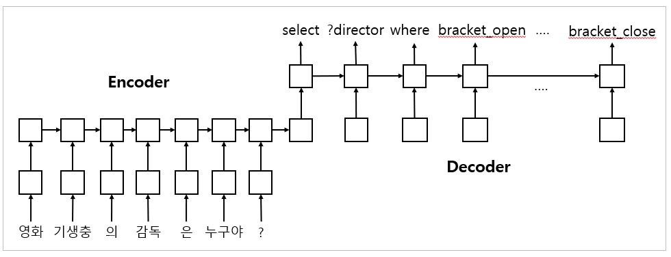

# Seq2SPARQL

Neural machine translation 모델을 사용해 자연어 질의로부터 SPARQL을 생성하는 프로그램입니다.



script를 실행하여 영화 관련 한글 자연어 질의-SPARQL 쌍 데이터를 생성할 수 있고,<br>
[fairseq](https://github.com/pytorch/fairseq), [tensorflow-nmt](https://github.com/tensorflow/nmt)에서 제공하는 여러 sequence-to-sequence 모델을 사용할 수 있습니다.

이 저장소는 fairseq, tensorflow-nmt module를 사용하기 때문에 clone 후 submodule을 checkout 해야합니다.


```bash
git submodule update --init
```

# References
본 저장소는 아래 코드들을 기반으로 하고 있습니다.

- https://github.com/pytorch/fairseq
- https://github.com/tensorflow/nmt
- https://github.com/AKSW/NSpM
